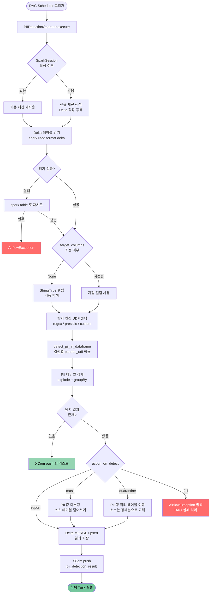
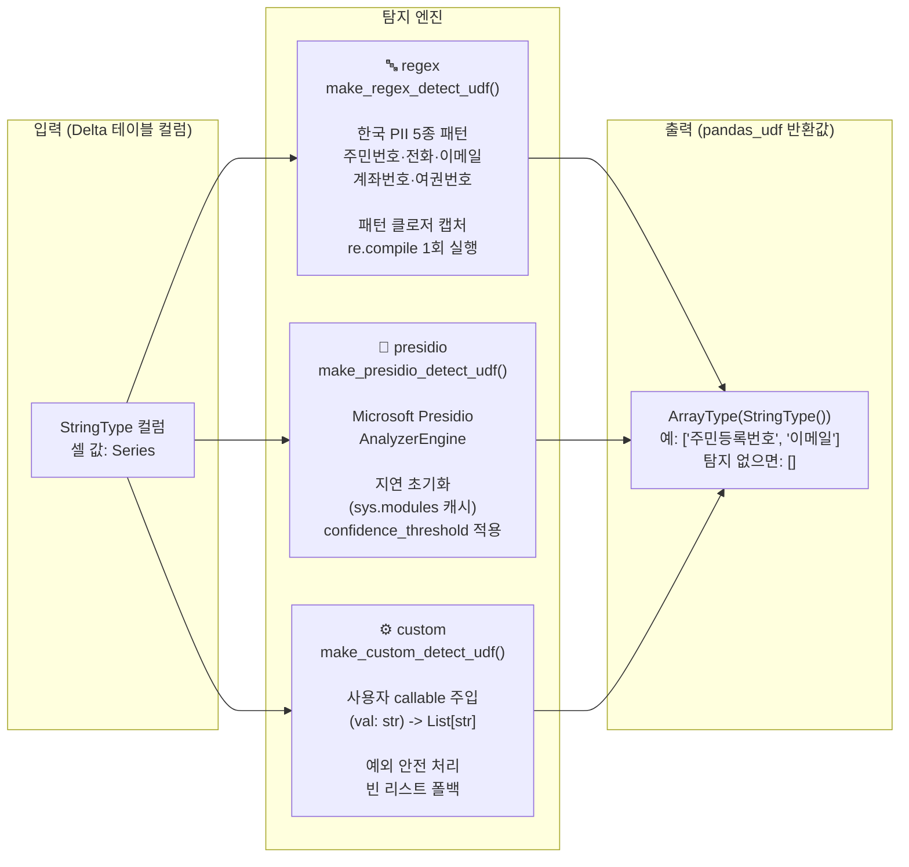
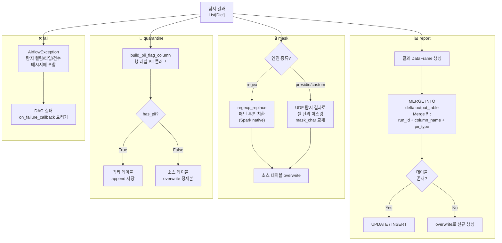
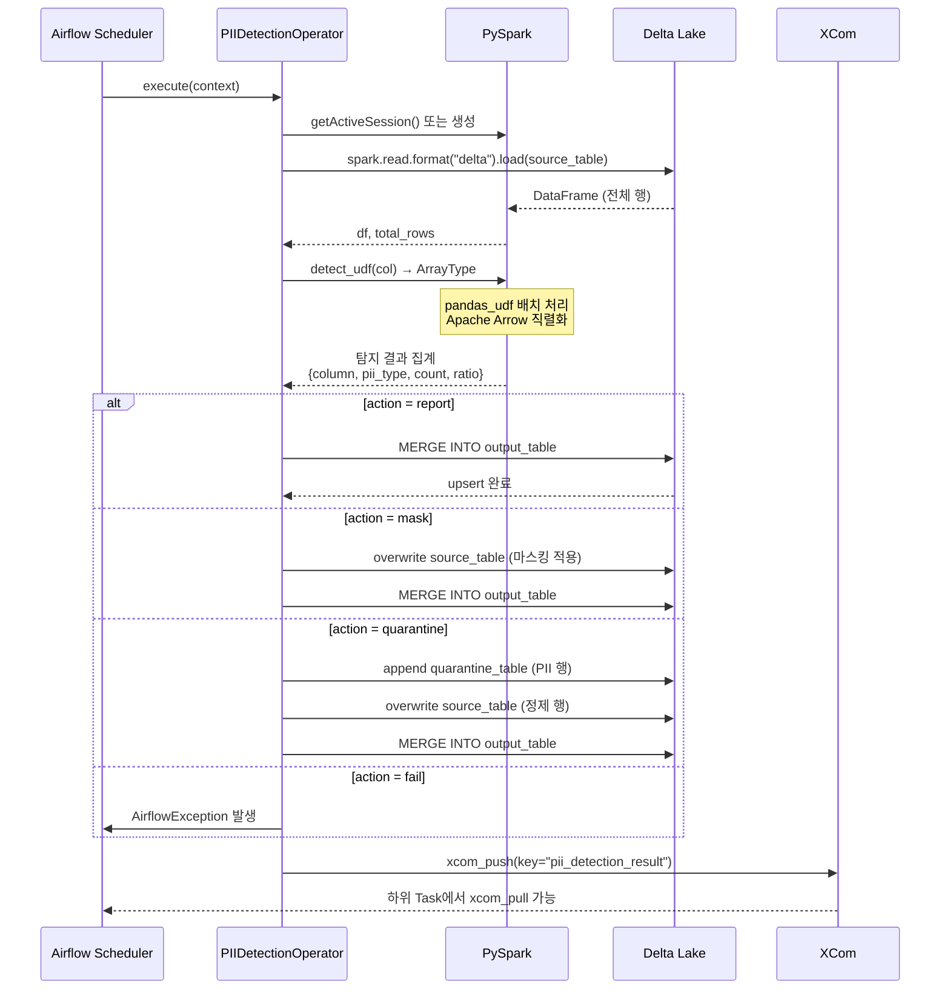
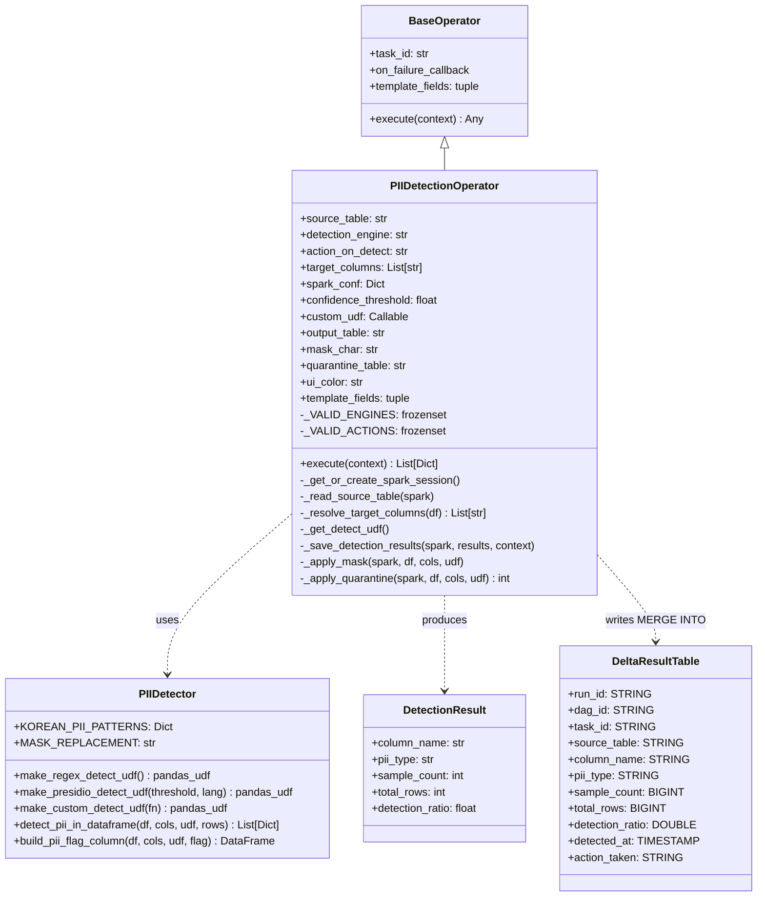

# PIIDetectionOperator — 설계 문서

## 목차
1. [개요](#1-개요)
2. [아키텍처 개념](#2-아키텍처-개념)
3. [컴포넌트 구조](#3-컴포넌트-구조)
4. [전체 프로그램 흐름](#4-전체-프로그램-흐름)
5. [탐지 엔진별 흐름](#5-탐지-엔진별-흐름)
6. [액션별 처리 흐름](#6-액션별-처리-흐름)
7. [데이터 흐름 다이어그램](#7-데이터-흐름-다이어그램)
8. [클래스 설계](#8-클래스-설계)
9. [Delta Lake 저장 설계](#9-delta-lake-저장-설계)
10. [설계 결정 근거](#10-설계-결정-근거)

---

## 1. 개요

`PIIDetectionOperator`는 Apache Airflow 파이프라인에서 **Delta Lake 테이블 내 개인식별정보(PII)를 자동 탐지**하고 정책에 따라 처리하는 Custom Operator입니다.

### 핵심 목표

| 목표 | 설명 |
|------|------|
| **자동화** | Airflow DAG 내에서 PII 탐지를 스케줄 기반으로 실행 |
| **확장성** | PySpark 분산 처리로 수억 행 테이블도 처리 가능 |
| **다형성** | regex / presidio / custom 3가지 엔진 교체 가능 |
| **멱등성** | DAG 재실행(Clear) 시에도 결과 중복 없이 upsert |
| **감사 추적** | 모든 탐지 이력을 Delta 테이블에 영구 보존 |

---

## 2. 아키텍처 개념

```
┌─────────────────────────────────────────────────────────────────┐
│                        Apache Airflow                           │
│                                                                 │
│   DAG Scheduler                                                 │
│       │                                                         │
│       ▼                                                         │
│  ┌────────────────────────────────────────────────────────┐    │
│  │              PIIDetectionOperator                      │    │
│  │  (BaseOperator 상속)                                   │    │
│  │                                                        │    │
│  │  ┌──────────────┐   ┌──────────────┐                  │    │
│  │  │ SparkSession │   │  UDF 팩토리  │                  │    │
│  │  │  관리        │   │  (엔진 선택) │                  │    │
│  │  └──────┬───────┘   └──────┬───────┘                  │    │
│  │         │                  │                           │    │
│  │         ▼                  ▼                           │    │
│  │  ┌────────────────────────────────────────────┐       │    │
│  │  │           Apache Spark (PySpark)            │       │    │
│  │  │                                             │       │    │
│  │  │  Delta Read ──► pandas_udf ──► 집계         │       │    │
│  │  └────────────────────┬───────────────────────┘       │    │
│  │                       │                               │    │
│  │                       ▼                               │    │
│  │  ┌─────────────────────────────────────────┐         │    │
│  │  │              Action 분기                │         │    │
│  │  │  report │ mask │ quarantine │ fail       │         │    │
│  │  └─────────────────────────────────────────┘         │    │
│  └────────────────────────────────────────────────────────┘    │
│       │                                                         │
│       ▼                                                         │
│   XCom push ──► 하위 Task                                      │
└─────────────────────────────────────────────────────────────────┘
                    │
                    ▼
           ┌────────────────┐
           │   Delta Lake   │
           │                │
           │ source_table   │
           │ output_table   │
           │ quarantine_tbl │
           └────────────────┘
```

---

## 3. 컴포넌트 구조

```
airflow-deltalake-spark/
│
├── airflow/operators/
│   └── pii_detection.py        ← Operator 본체
│       ├── PIIDetectionOperator (BaseOperator)
│       │   ├── __init__()            파라미터 검증
│       │   ├── execute()             실행 진입점
│       │   ├── _get_or_create_spark_session()
│       │   ├── _read_source_table()
│       │   ├── _resolve_target_columns()
│       │   ├── _get_detect_udf()
│       │   ├── _save_detection_results()  MERGE INTO
│       │   ├── _apply_mask()
│       │   └── _apply_quarantine()
│
├── utils/
│   └── pii_detector.py         ← UDF 모듈 (엔진 독립)
│       ├── KOREAN_PII_PATTERNS       정규식 상수
│       ├── make_regex_detect_udf()   팩토리
│       ├── make_presidio_detect_udf() 팩토리
│       ├── make_custom_detect_udf()  팩토리
│       ├── detect_pii_in_dataframe() 집계 헬퍼
│       └── build_pii_flag_column()   행 레벨 플래그
│
├── sql/
│   └── pii_detection_results_ddl.sql  Delta DDL
│
└── dags/
    └── pii_detection_dag_example.py   사용 예시 4종
```

---

## 4. 전체 프로그램 흐름



---

## 5. 탐지 엔진별 흐름



### 정규식 패턴 상세

| PII 유형 | 패턴 | 예시 |
|----------|------|------|
| 주민등록번호 | `\d{6}-[1-4]\d{6}` | `901231-1234567` |
| 전화번호 | `01[0-9]-\d{3,4}-\d{4}` | `010-1234-5678` |
| 이메일 | `[a-zA-Z0-9._%+\-]+@[a-zA-Z0-9.\-]+\.[a-zA-Z]{2,}` | `user@example.com` |
| 계좌번호 | `\d{3,6}-\d{2,6}-\d{2,6}` | `110-123-456789` |
| 여권번호 | `[A-Z]{1,2}\d{7,8}` | `M12345678` |

---

## 6. 액션별 처리 흐름



---

## 7. 데이터 흐름 다이어그램



---

## 8. 클래스 설계



---

## 9. Delta Lake 저장 설계

### 결과 테이블 스키마

```
pii_detection_results
├── run_id          STRING    Airflow DAG Run ID (MERGE 키)
├── dag_id          STRING    Airflow DAG ID (파티션 키)
├── task_id         STRING    Airflow Task ID
├── source_table    STRING    소스 Delta 테이블 경로
├── column_name     STRING    탐지된 컬럼명 (MERGE 키)
├── pii_type        STRING    PII 유형 (MERGE 키)
├── sample_count    BIGINT    탐지 행 수
├── total_rows      BIGINT    전체 행 수
├── detection_ratio DOUBLE    탐지 비율 (0.0 ~ 1.0)
├── detected_at     TIMESTAMP 탐지 수행 시각 (UTC)
└── action_taken    STRING    수행 액션
```

### MERGE INTO 전략

```
MERGE 키: (run_id, column_name, pii_type)

        소스 DataFrame
              │
              ▼
    ┌─────────────────┐
    │  MERGE INTO     │
    │  output_table   │
    └────────┬────────┘
             │
      ┌──────┴──────┐
      │             │
   매칭됨        미매칭
      │             │
   UPDATE *      INSERT *
   (재실행 시)   (신규 삽입)
```

### 파티셔닝 전략

```
PARTITIONED BY (dag_id)

이유:
  - 가장 흔한 쿼리 패턴: "특정 DAG의 최근 탐지 이력"
  - DAG별 파티션으로 불필요한 스캔 제거
  - autoOptimize: Small File Problem 예방
  - ZORDER BY (dag_id, detected_at): 복합 쿼리 최적화 (주 1회 권장)
```

---

## 10. 설계 결정 근거

### pandas_udf 선택 이유

```
일반 Python UDF              pandas_udf (Arrow 기반)
─────────────────            ─────────────────────────
행 단위 직렬화               배치 직렬화 (Arrow 포맷)
객체 오버헤드 높음           메모리 복사 최소화
GIL 병목                     벡터화 연산 가능
속도: 기준                   속도: 3~10x 빠름
```

### UDF 팩토리 패턴

```python
# 팩토리 반환 → 엔진 교체 시 Operator 코드 변경 불필요
detect_udf = make_regex_detect_udf()     # regex
detect_udf = make_presidio_detect_udf()  # presidio
detect_udf = make_custom_detect_udf(fn)  # custom

# 세 함수 모두 동일한 시그니처 반환
# pandas_udf(Series) -> Series[ArrayType(StringType())]
```

### Presidio 지연 초기화

```python
# AnalyzerEngine은 직렬화 불가 → UDF 내부에서 생성
# sys.modules를 캐시로 사용 → executor 프로세스당 1회만 초기화

cache_key = f"_presidio_analyzer_{lang}"
if cache_key not in sys.modules:
    sys.modules[cache_key] = AnalyzerEngine()  # 1회 생성
analyzer = sys.modules[cache_key]              # 이후 재사용
```

### mask 엔진별 전략 차이

```
regex 엔진:
  컬럼값: "연락처: 010-1234-5678, 이메일: test@test.com"
  결과:   "연락처: ***, 이메일: ***"
  방식: regexp_replace (Spark native, UDF 없음)

presidio/custom 엔진:
  컬럼값: "김철수 (SSN: 901231-1234567)"
  결과:   "***"  ← 셀 전체 교체
  방식: UDF 탐지 → when(has_pii, mask_char)
```

### quarantine 원자성 보장

```
quarantine_table ←── PII 포함 행 (append)
                              │
source_table ←────── 정제 행 (overwrite)
                              │
Delta 트랜잭션으로 각 쓰기 원자 보장
(Spark 장애 시 Delta 로그로 복구 가능)
```

---

## 테스트 전략

```
tests/
├── unit/                    ← Spark 불필요, 수 초 이내
│   └── test_pii_detector.py
│       ├── TestKoreanPiiPatterns    정규식 패턴 정확성 (25 케이스)
│       ├── TestRegexDetectionLogic  UDF 내부 로직 (7 케이스)
│       ├── TestCustomDetectUdf      팩토리 동작 (3 케이스)
│       ├── TestMakeRegexDetectUdf   팩토리 검증 (2 케이스)
│       └── TestEdgeCases            경계값/오탐 (5 케이스)
│
└── integration/             ← 로컬 Spark + 임시 Delta
    └── test_pii_detection_operator.py
        ├── TestOperatorParameterValidation  파라미터 검증
        ├── TestRegexReportAction            report 엔드투엔드
        ├── TestRegexMaskAction              mask 검증
        ├── TestCustomQuarantineAction       quarantine 검증
        ├── TestFailAction                   fail 예외 검증
        ├── TestCleanDataHandling            정상 데이터 처리
        └── TestColumnAutoDetection          StringType 자동 탐지
```

---

*문서 작성: PIIDetectionOperator v1.0*
